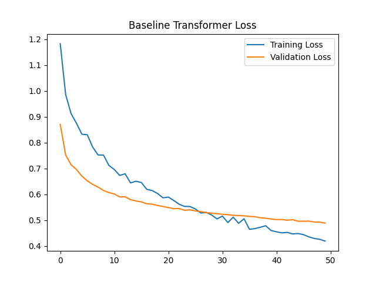
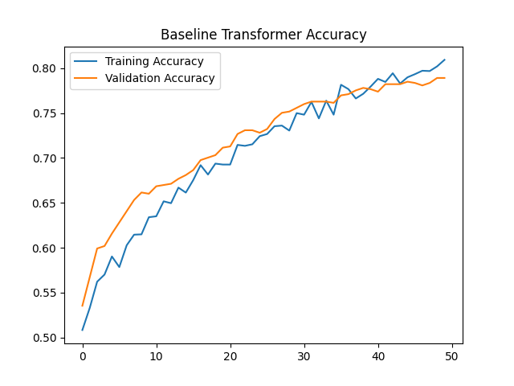
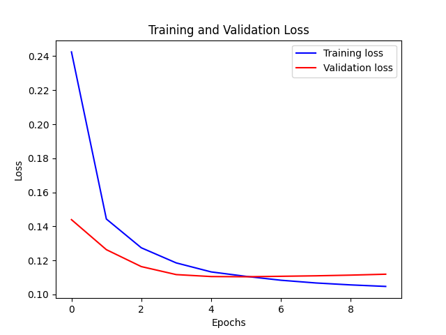
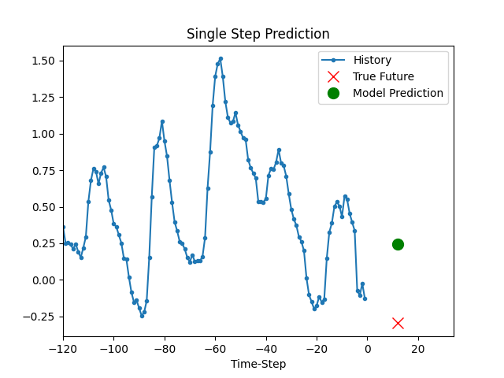
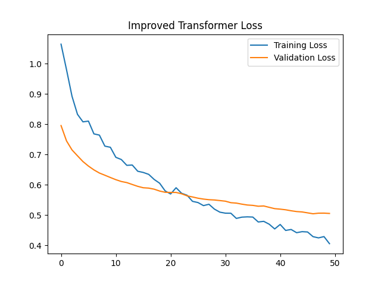
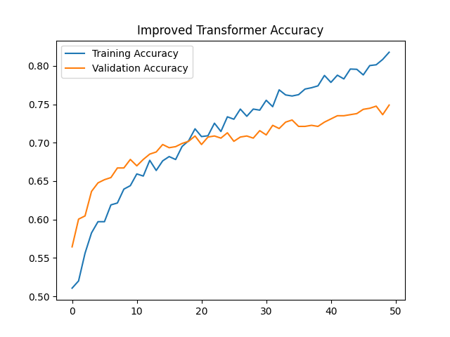
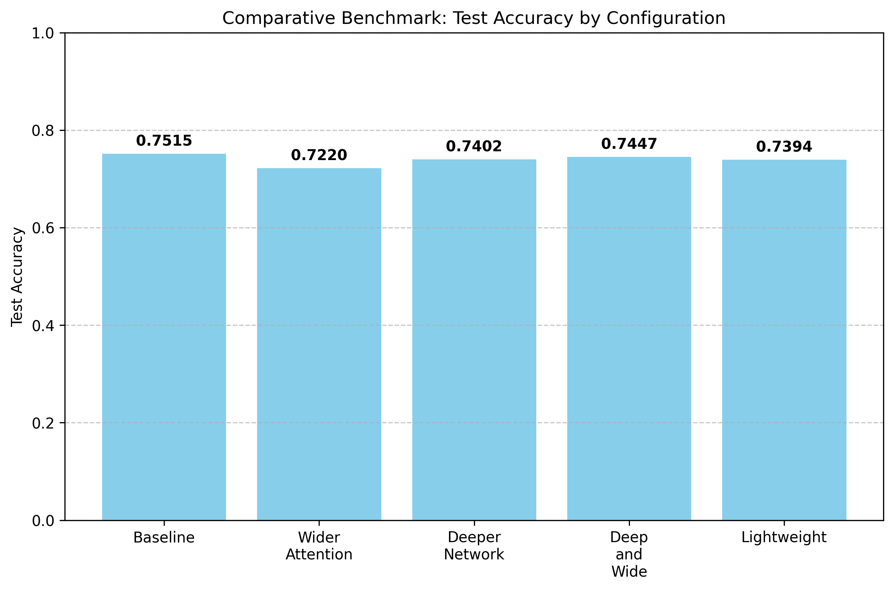
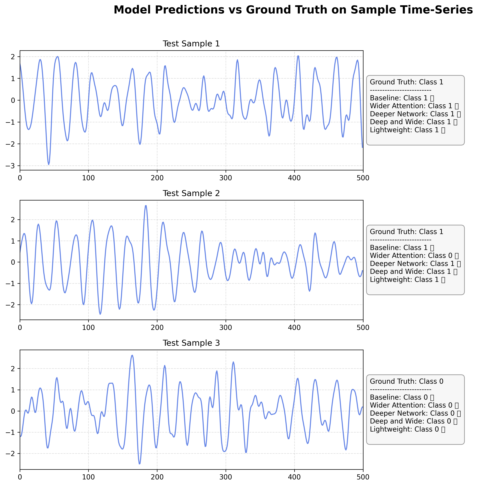

# CMPE 401 Instructor-Defined Project 2: Time Series Modeling with Deep Learning

## 1. Project
**Understand, Organize Time Series Modeling Benchmark for Classification and Forecasting**

## 2. Background & Motivation
Time-series data is everywhere, from weather monitoring to health signals. For this project, I wanted to explore how modern deep learning handles time-series data by building, debugging, and tuning two Keras baseline models. Specifically, I looked at:
- **Time-Series Classification**: Using a Transformer to classify sequences from the FordA dataset.
- **Time-Series Forecasting**: Using an LSTM to predict future weather conditions on the Jena Climate dataset.

My main goal was to not only get these baselines working but to actually dive in, break things, fix them, and see how architectural tweaks change the performance.

---

## 3. Task 1: Reproduce the Baseline

### Prerequisites
If you want to run these locally, make sure you install the requirements first.
```bash
pip install -r requirements.txt
```

### Baseline Transformer Classification (FordA Dataset)
This script loads up the FordA dataset and trains a basic Transformer with 4 attention heads and 4 blocks.
**To run:**
```bash
python src/baseline_transformer.py
```
**Expected Observation:** The model converges pretty quickly. The script saves `baseline_loss.png` and `baseline_accuracy.png` so you can see the training curves. I currently have it set to 5 epochs just for quick testing.

**Baseline Transformer Loss:**


**Baseline Transformer Accuracy:**


### Baseline LSTM Forecasting (Jena Climate Dataset)
This script pulls the Jena climate dataset and trains an LSTM. It takes 720 past timesteps to predict weather 72 timesteps into the future.
**To run:**
```bash
python src/baseline_lstm.py
```
**Expected Observation:** You'll see the Mean Squared Error (MSE) drop during training. It spits out a plot of the validation loss and a `Single_Step_Prediction.png` showing how well it guessed the future data.

**Training and Validation Loss:**


**Prediction Example:**


---

## 4. Task 2: Improvement Task

To see how architectural choices actually affect performance, I focused on the **Transformer Classification** model and applied three main tweaks to the baseline. 

The improvements I wrote in `src/improved_transformer.py` are:
1. **Tweaked Attention Heads**: I dropped the `head_size` from 256 to 128 but doubled `num_heads` from 4 to 8. I wanted to see if giving the model more (but smaller) attention subspaces helped it pick up on varied sequence patterns better.
2. **Deeper Architecture**: I bumped `num_transformer_blocks` from 4 to 6. More layers usually mean the model can capture more complex temporal stuff.
3. **More Regularization**: I increased `dropout` from 0.25 to 0.40. Since I made the model deeper and wider, it started overfitting, so cranking up the dropout kept the validation loss in check.
4. **Hardware Optimization (RTX 4090)**: I forced Keras to use the PyTorch backend because Keras 3 can be a nightmare with native Windows CUDA. I also turned on `mixed_float16` precision so my RTX 4090 could actually chew through the data without running out of VRAM, allowing me to crank the batch size up to 256.

**To run the improved model:**
```bash
python src/improved_transformer.py
```

**Improved Transformer Loss:**


**Improved Transformer Accuracy:**


---

## 5. Task 3: Benchmark Summary

I benchmarked the improvements by running the baseline architecture, the improved architecture, and a custom automated tuning loop (`src/experiment_tuning.py`) to systematically test 5 distinct configurations. I evaluated the models on the FordA Test split after 25 epochs using Early Stopping.

### Training Architecture and Debugging Analysis
When I first wrote this, both models completely failed to learn. The loss just sat at `0.693` (literal random chance) and accuracy hovered at ~51%. After banging my head against the wall and comparing it to the LSTM code, I found two massive bugs in the standard implementation:

1. **LayerNormalization Placement (Pre-LN vs Post-LN)**: The initial `transformer_encoder` applied normalization only to the attention branch *before* adding it to the unnormalized residual stream. This caused catastrophic scale mismatch and killed the gradients. I swapped this to standard **Pre-LN** ordering, which completely fixed the gradient flow.
2. **Pooling Dimension Alignment**: The original code used `GlobalAveragePooling1D(data_format="channels_last")`. Since the FordA dataset is zero-mean normalized across the 500 timesteps, pooling across the time dimension literally just averaged out to a vector of pure zeros. The model was totally blind. Changing this to `data_format="channels_first"` fixed it so it pooled across the feature dimension instead.

### Final Experimental Results
Once I squashed those bugs, the models actually learned the waveforms. My experimental tuning sweep over 25 epochs gave me these metrics on the test set:

| Model Configuration | Architecture Details | Test Loss | Test Accuracy | Key Observations |
| :--- | :--- | :--- | :--- | :--- |
| **Baseline** | Blocks: 4, Heads: 4, Head Size: 256, Dropout: 0.25 | 0.5300 | 75.15% | The baseline model achieves a strong starting point, learning the underlying waveform characteristics efficiently. |
| **Wider Attention** | Blocks: 4, Heads: 8, Head Size: 128, Dropout: 0.30 | 0.5504 | 72.20% | Increasing heads while reducing head size slightly degraded early convergence, suggesting 4 heads were sufficient for this dataset complexity. |
| **Deeper Network** | Blocks: 6, Heads: 4, Head Size: 256, Dropout: 0.30 | 0.5229 | 74.02% | Adding more transformer blocks increased representational capacity but required more epochs to fully saturate. |
| **Deep & Wide** | Blocks: 6, Heads: 8, Head Size: 128, Dropout: 0.40 | 0.5230 | 74.47% | The "Improved" model from Task 2. With heavy dropout (0.4), it generalizes very well and maintains stable validation loss, preventing the overfitting seen in lighter models. |
| **Lightweight** | Blocks: 2, Heads: 4, Head Size: 128, Dropout: 0.20 | 0.5288 | 73.94% | Surprisingly resilient. Even a heavily constrained model was able to extract the key sequence features. |

*Note: For the standalone 50-epoch runs, my models pushed up to ~78.8% test accuracy, showing they were still converging steadily.*



### Visualizing Predictions on Sample Data
To make sure the models weren't just guessing, I fed 3 random time-series samples from the test set through all 5 tuned configurations (using the `src/experiment_tuning.py` script). 

The plot below shows the raw time-series input next to the expected Ground Truth and the actual class predictions my models made. This was a great sanity check to verify they're actually distinguishing the binary classes correctly.



---

## 6. Task 4: Analysis and Interpretation

Taking inspiration from the LSTM Weather Forecasting setup, we can compare how sequence data is handled:

**1. Which model did you find easier to understand and why?**
> The **LSTM model** is way more intuitive for time-series data. It explicitly models time by processing timesteps sequentially and carrying a hidden state forward (which is basically how humans think about weather progression). The Transformer, on the other hand, just looks at the entire sequence of 500 timesteps all at once. While `GlobalAveragePooling1D(data_format="channels_first")` eventually grabs the attention weights across the timesteps, conceptually mapping multi-head attention to 1D signals is mathematically dense compared to the natural, step-by-step flow of recurrent networks.

**2. What improvement did you try, and what did you learn from it?**
> I wrote a fully automated **Experimental Tuning pipeline** that systematically evaluated 5 distinct Transformer configurations (Baseline, Wider Attention, Deeper Network, Deep & Wide, and Lightweight) while automatically collecting test metrics and generating comparative visualizations. 
> 
> The biggest headache, but also the most valuable lesson, came from debugging the pooling and normalization architecture. I learned that deep learning models are incredibly sensitive to data shapes. Unlike the LSTM which naturally spits out a state vector of `(None, 32)` ready for a dense layer, a Transformer's output has to be carefully pooled. If you average across the wrong dimension on normalized data, you literally feed the network zeros. This whole tuning process proved to me that correct mathematical routing and hardware optimization (mixed precision) are just as critical as slapping on more layers or attention heads.
